# Sphere E2E Test Framework — Introduction

## What Is This?

The Sphere E2E Test Framework is a **pytest-based automation framework** purpose-built
for end-to-end testing of Sphere HSM (Hardware Security Module) devices and their
supporting applications.

It automates the full test lifecycle: **launch app → execute steps → capture evidence
→ report results** — across Windows desktop apps (E-Admin, CPS, Proxy) and
console/CLI tools (PKCS#11 in Go, Java, C++).

### Who Is This For?

- **QA Engineers** writing new UI or console tests for HSM applications
- **Developers** validating HSM features in CI/CD pipelines
- **Team Leads** tracking test coverage and results via Grafana/TCMS dashboards

---

## What Does It Cover?

### Applications Under Test

| Application | Type | Status | Test Location |
|-------------|------|--------|---------------|
| **E-Admin** | WinForms desktop app | Active (7 test classes) | `tests/ui/e_admin/` |
| **CPS** | WinForms desktop app | Scaffolded (ready to write) | `tests/ui/cps/` |
| **Proxy** | WinForms desktop app | Scaffolded (ready to write) | `tests/ui/proxy/` |
| **PKCS#11 Tools** | CLI (Go, Java, C++, GTest) | Active (1 test class) | `tests/console/pkcs11/` |

### Test Scenarios (E-Admin)

| Test Case | TCMS ID | What It Tests |
|-----------|---------|---------------|
| Key Ceremony (FIPS) | TC-37509 | Full FIPS key ceremony workflow |
| Key Ceremony (Non-FIPS) | TC-37515 | Non-FIPS key ceremony workflow |
| Operational User Creation | TC-37516 | Create operational users with roles |
| HSM Reset by Super User | TC-37517 | HSM reset via super user privileges |
| Delete Operational User | TC-37520 | User deletion and verification |

---

## Architecture Overview

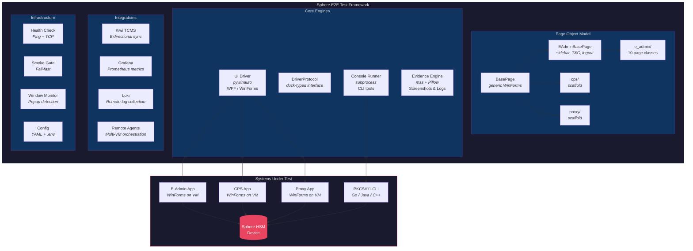

---

## Test Execution Lifecycle

Every `pytest` run follows this lifecycle — from environment validation to result reporting:

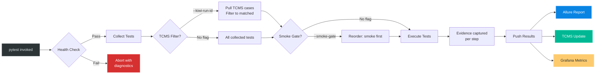

---

## Core Capabilities

### 1. Windows UI Automation

Automates WinForms and WPF desktop applications using pywinauto:

- **Launch & connect** to applications by path or window class
- **Interact with UI elements** — click buttons, type text, select dropdowns, navigate tabs
- **Wait for elements** — explicit waits instead of `sleep()`, with configurable timeouts
- **Auto-dismiss popups** — configurable button list for automatic popup handling
- **Window monitoring** — background thread detects unexpected windows during tests
- **Element discovery** — `inspect_app.py` tool scans running apps for automation IDs

### 2. Console/CLI Tool Testing

Wraps existing command-line tools (PKCS#11, etc.) without modifying their source code:

- **Subprocess execution** with stdout/stderr capture and timeout
- **Cross-platform** — separate commands for Windows and Linux
- **Built-in assertions** — `assert_success()`, `assert_output_contains()`
- **Language helpers** — `run_java()`, `run_go()`, `run_make()`, `run_executable()`

### 3. Evidence Engine

Every test produces a complete evidence trail — automatically:

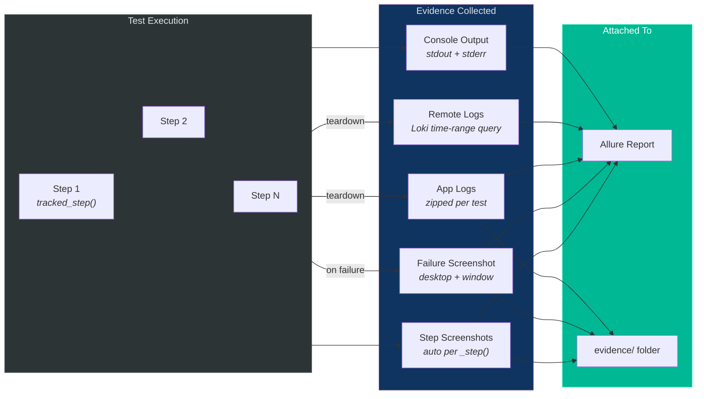

### 4. Page Object Model (POM)

Each application screen is a Python class that encapsulates UI interactions:

```python
# Fluent navigation — methods return the next page
login = LoginPage(driver, evidence)
dashboard = login.connect_to_hsm(step_name="Connect to HSM")
dashboard.create_user(username="operator1", step_name="Create user")
```

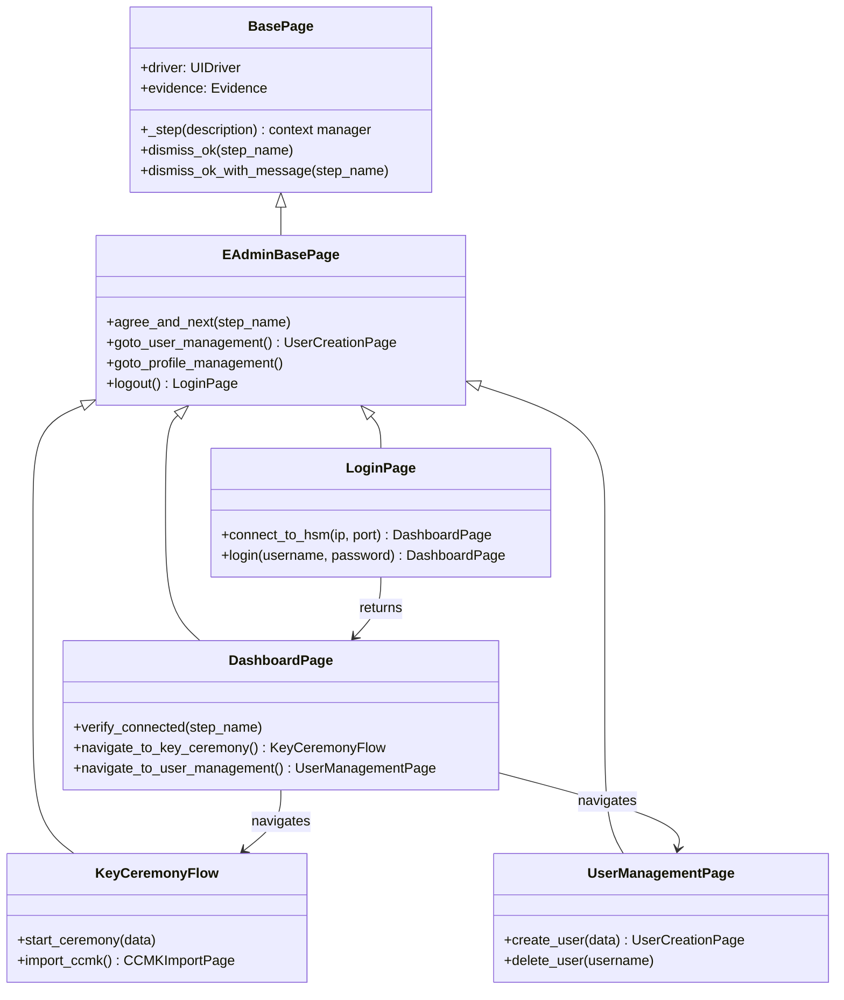

Key patterns:
- **`_step()` context manager** — wraps actions with Allure steps + auto-screenshots
- **Fluent return** — each method returns the next page object
- **Evidence optional** — page objects work with or without evidence tracking
- **`BasePage`** — generic WinForms helpers (dismiss dialogs, `_step()`)
- **`EAdminBasePage`** — E-Admin-specific navigation (sidebar, T&C acceptance, logout)

### 5. Health Checks

Pre-execution verification ensures the test environment is ready before running:

- **Ping check** — HSM device is network-reachable
- **TCP check** — Required ports are open
- **Configurable** in `settings.yaml` → `health_check:`
- **Skip with** `pytest --skip-health-check`

### 6. Smoke Gate

Fail-fast mechanism: if any `@pytest.mark.smoke` test fails, abort remaining tests.

```bash
pytest --smoke-gate      # All smoke tests run first; abort if any fail
```

---

## Integrations

### Kiwi TCMS — Test Case Management

Bidirectional sync between Python tests and Kiwi TCMS test cases:

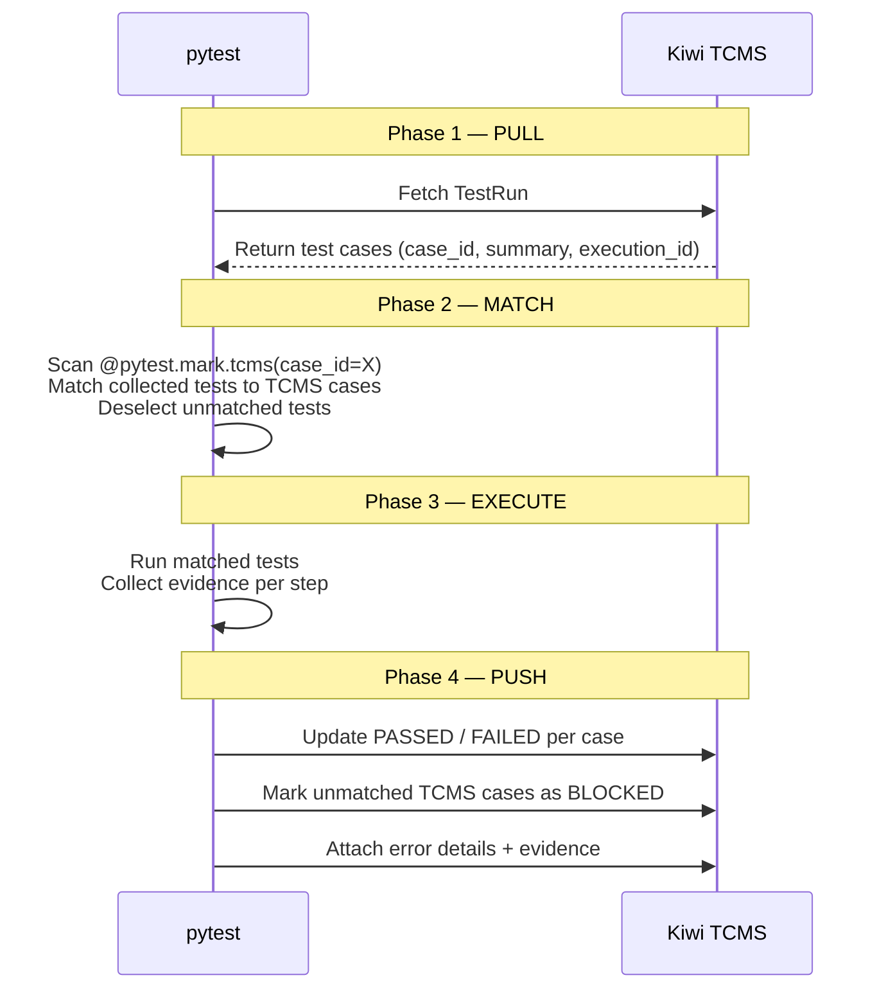

### Grafana + Prometheus — Metrics Dashboard

Test results are pushed to Prometheus Pushgateway, visualized in Grafana:

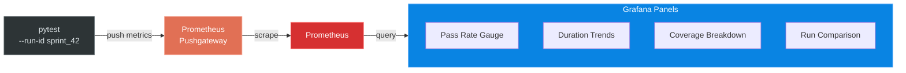

### Loki — Remote Log Collection

After each test, the framework queries Loki for logs from all configured VMs
within the test's time range. Logs are saved, zipped, and attached to the Allure report.

Useful for multi-VM scenarios where the HSM, Proxy, and Admin apps run on separate machines.

### Remote Agents — Multi-VM Orchestration

HTTP-based agents running on remote Windows VMs allow the framework to:

- Execute scripts and commands on remote machines
- Capture remote screenshots
- Coordinate multi-VM test scenarios (e.g., Admin on VM1, Proxy on VM2)

---

## Configuration

The framework uses a layered configuration approach:

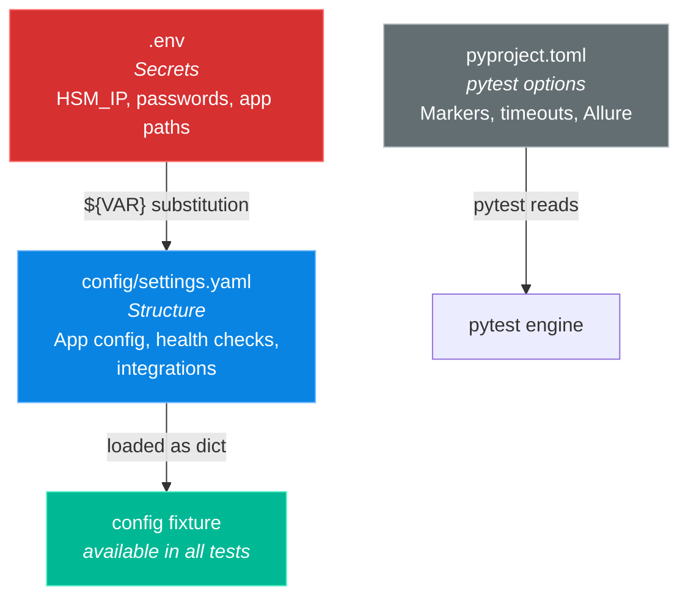

All `${ENV_VAR}` placeholders in `settings.yaml` are resolved from `.env` at runtime.

Additional config mechanisms:
- **`env_overrides`** — data-driven mapping of env vars to dotted config paths (supports `:int` / `:bool` type hints)
- **`env_overrides_list`** — list-based overrides for array config entries (e.g. `health_check.checks`)
- **Config path:** Set `SPHERE_CONFIG_PATH` to override the default config file location (falls back to `HSM_CONFIG_PATH`)

---

## How Tests Are Structured

```
tests/
├── ui/
│   ├── e_admin/
│   │   ├── conftest.py                    ← App-specific fixtures
│   │   ├── test_TC-37509_KeyCeremony...   ← Test classes (1 per TCMS case)
│   │   └── ...
│   ├── cps/
│   │   └── conftest.py                    ← Scaffolded, ready to write tests
│   └── proxy/
│       └── conftest.py                    ← Scaffolded, ready to write tests
└── console/
    └── pkcs11/
        └── test_pkcs11_sample.py          ← CLI tool wrapper tests
```

### Fixture Loading (Layered Conftest)

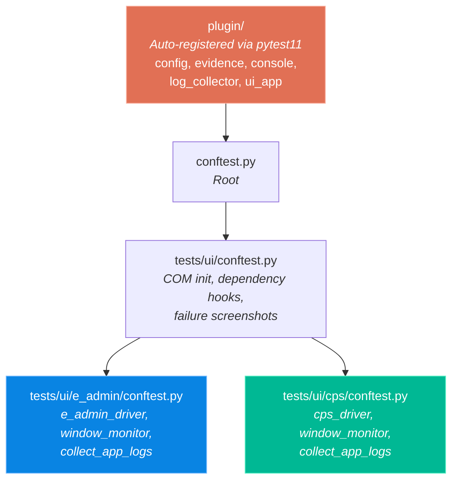

Each conftest only loads when tests in that directory are selected — no unnecessary imports.

### Test File Convention

Each test file follows this pattern:

```python
@allure.epic("Sphere HSM")
@allure.feature("E-Admin - Key Ceremony")
@pytest.mark.ui
@pytest.mark.e_admin
@pytest.mark.tcms(case_id=37509)
class TestKeyCeremonyFIPS:

    @pytest.fixture(autouse=True)
    def setup(self, e_admin_driver, evidence, e_admin_config):
        self.driver = e_admin_driver
        self.evidence = evidence
        yield

    def test_key_ceremony_fips(self):
        login = LoginPage(self.driver, self.evidence)
        dashboard = login.connect_to_hsm(step_name="Connect to HSM")
        # ... test steps with evidence tracking
```

### Naming Convention

- **File**: `test_TC-{TCMS_ID}_{DescriptiveName}.py`
- **Class**: `Test{DescriptiveName}`
- **Method**: `test_{specific_scenario}`
- **Allure tags**: Map directly to TCMS bracket tags: `[E2E][eAdmin][Connect]`

---

## Reporting

### Allure Report

The primary reporting output — rich HTML reports with:

- Step-by-step execution with screenshots
- Pass/fail/skip/broken status per test
- Suite-level and feature-level grouping
- Attached evidence (logs, screenshots, app logs)
- Severity and priority labels
- Links to TCMS test cases

```bash
npx allure open evidence/allure-results    # View report (Allure 3)
```

### CI/CD Pipeline (Jenkins)

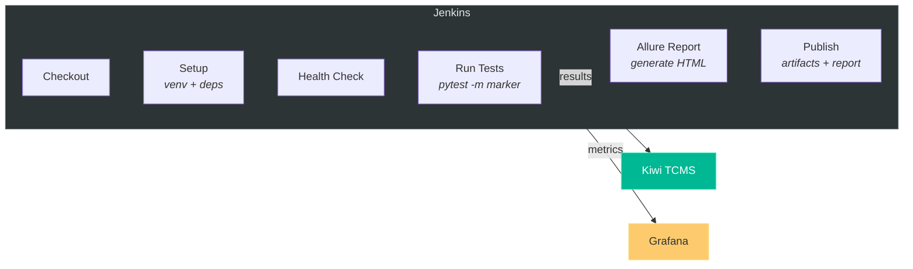

### Kiwi TCMS Report

Test results synced back to TCMS TestRuns — visible in the TCMS web interface with:

- Per-case PASSED/FAILED/BLOCKED status
- Error details and evidence attachments on failure
- Coverage gap warnings for unautomated test cases

### Grafana Dashboard

Import `config/grafana-dashboard.json` for real-time metrics:

- Current run status (pass rate, duration, coverage)
- Historical trends across runs
- Per-test duration tracking
- Run comparison via dropdown selector

---

## Multi-VM Test Environment

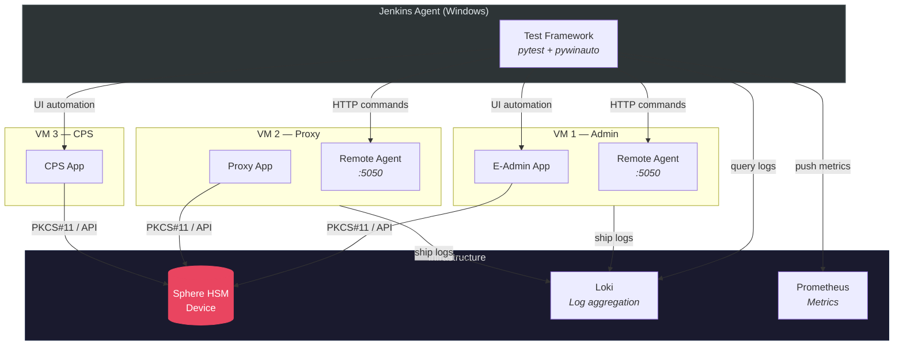

---

## Technology Stack

| Component | Technology | Purpose |
|-----------|-----------|---------|
| Test Framework | pytest 7+ | Test execution, fixtures, markers, hooks |
| UI Automation | pywinauto | Windows desktop app control (WPF/WinForms) |
| Screenshots | mss + Pillow | Desktop and element capture |
| Reporting | Allure 3 | HTML test reports with evidence |
| Test Management | Kiwi TCMS | Bidirectional test case sync |
| Metrics | Prometheus + Grafana | Dashboard and trend visualization |
| Log Aggregation | Grafana Loki | Remote VM log collection |
| Configuration | PyYAML + python-dotenv | YAML config with env var substitution |
| CI/CD | Jenkins (Jenkinsfile) | Multi-platform pipeline execution |
| Language | Python 3.9+ (3.11 recommended) | Framework and test code |

---

## CLI Quick Reference

| Command | Description |
|---------|-------------|
| `pytest tests/ui/e_admin/ -v` | Run all E-Admin tests |
| `pytest -m smoke -v` | Run smoke tests only |
| `pytest -m "e_admin and critical"` | E-Admin critical tests |
| `pytest --kiwi-run-id=123` | Sync with TCMS TestRun #123 |
| `pytest --run-id sprint_42` | Tag run for Grafana |
| `pytest --smoke-gate` | Abort if smoke fails |
| `pytest --skip-health-check` | Skip environment checks |
| `pytest --co -v` | Dry run — list collected tests |
| `python scripts/inspect_app.py "App.exe"` | Discover UI element IDs |

---

## Getting Started

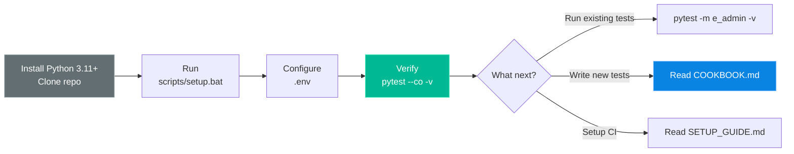

| Step | Action | Guide |
|------|--------|-------|
| 1 | Install Python 3.11+, clone repo, run `scripts/setup.bat` | [SETUP_GUIDE.md](../SETUP_GUIDE.md) |
| 2 | Configure `.env` with HSM_IP, app paths | [SETUP_GUIDE.md](../SETUP_GUIDE.md) |
| 3 | Run existing tests | [README.md](../README.md) |
| 4 | Write tests for a new app (CPS/Proxy) | [COOKBOOK.md](../COOKBOOK.md) |
| 5 | Set up Jenkins CI pipeline | [SETUP_GUIDE.md](../SETUP_GUIDE.md) |
| 6 | Configure TCMS/Grafana (optional) | [SETUP_GUIDE.md](../SETUP_GUIDE.md) |
| 7 | Set up remote agents for multi-VM | [remote_agent_guide.md](remote_agent_guide.md) |

---

## Key Design Decisions

| Decision | Rationale |
|----------|-----------|
| **pytest plugin (auto-registered)** | Consumer repos get all fixtures/hooks by just installing the package — zero boilerplate |
| **Page Object Model** | Separates UI locators from test logic; one screen = one class |
| **`_step()` + evidence tracking** | Every action produces Allure steps with screenshots — no manual effort |
| **TCMS as source of truth** | Test procedures live in Kiwi TCMS (human-readable), automation code lives in Python (machine-executable) |
| **No BDD/Gherkin** | Complex HSM workflows (20-30 steps) don't fit 1:1 step definitions. `tracked_step` provides the same documentation value without the overhead |
| **Health checks before execution** | Fail fast with clear diagnostics if HSM is unreachable, instead of cryptic timeouts during tests |
| **Separated conftest per app** | `tests/ui/e_admin/conftest.py` only loads when running E-Admin tests — no unnecessary imports |
| **Environment-based config** | `.env` for secrets, `settings.yaml` for structure — safe for version control |
| **DriverProtocol (duck typing)** | Enables injection of non-pywinauto drivers (Playwright, mock) without modifying core |
| **EAdminBasePage split** | New apps inherit clean `BasePage` without E-Admin navigation methods |

---

## Glossary

| Term | Meaning |
|------|---------|
| **E-Admin** | HSM Administration Application (WinForms desktop app) |
| **CPS** | Certificate Provisioning System |
| **Proxy** | HSM Proxy Application |
| **PKCS#11** | Cryptographic Token Interface Standard — the API HSMs expose |
| **POM** | Page Object Model — design pattern for UI test automation |
| **TCMS** | Test Case Management System (Kiwi TCMS) |
| **Evidence** | Screenshots, logs, and attachments collected during test execution |
| **tracked_step** | Context manager that creates an Allure step with auto-screenshot |
| **Smoke Gate** | Mechanism to abort test suite if critical smoke tests fail |
| **Health Check** | Pre-execution verification that the test environment is ready |
| **UIDriver** | Framework's pywinauto wrapper with popup handling and retry logic |
| **ConsoleRunner** | Framework's subprocess wrapper for CLI tool execution |
| **BasePage** | Generic WinForms base page with `_step()`, `dismiss_ok` — no app-specific methods |
| **EAdminBasePage** | E-Admin-specific base page with sidebar navigation and T&C acceptance |
| **DriverProtocol** | Runtime-checkable Protocol defining the driver interface for dependency injection |
